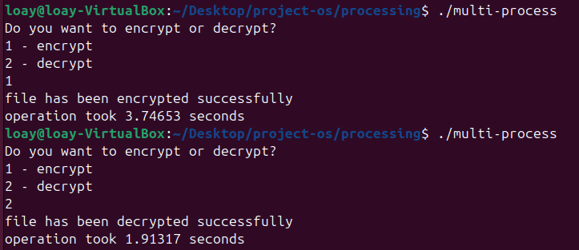

# Caesar Cipher Project

C++ program to encrypt/decrypt text files using Caesar cipher (shift by 2).

## Versions
- Normal (single-threaded)
- Process-based (fork)
- Multithreaded (threads + semaphores) — fastest

## Usage (Ubuntu)
```bash
git clone https://github.com/alahmad-loay2/encryption-project.git
```
cd to directory 
./normal-way
./multi-process
./multi-thread

#### or g++ to re create executables

## results 
multi threading version was the fastest due to having a shared memory and not being a cpu intesive task





